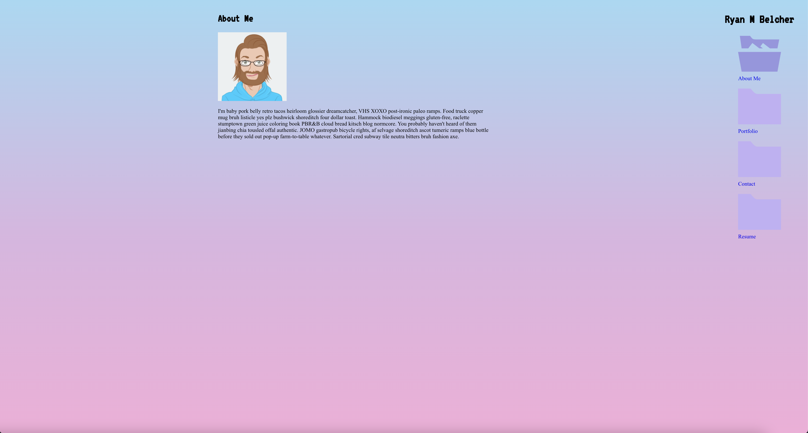

 

# react-portfolio

## Description

A bit over two months ago I created my first portfolio app using basic HTML and CSS. While I was proud of what I created, I knew that if I were to stick with learning that I could build a way better portfolio project. And here it is. Its fun to see how far I have come in such a short time.

This iteration of my portfolio utilizes React (the name probably gave that away already) instead of basic HTML and CSS. This app contains six of the projects that I have worked on over the last couple months while in boot camp. 

There is a lot that I want to do with this project over the next bit in order to make it even better. Please stay tuned as I see this as a living, breathing app that will continue to grow as I grow.

## Table of Contents

  - [Installation](#installation)
  - [Usage](#usage)
  - [License](#license)
  - [Credit](#credit)
  - [Questions](#questions)

## Installation

The app is deployed [here](https://ryanmbelcher.github.io/react-portfolio/) on github pages.

## Usage

## License

This application uses the MIT license.
  
MIT: https://choosealicense.com/licenses/mit/

## Credit 

I could not have done this without my amazing instructional team at the Penn Boot Camp-- Leif Hetland and Benjamin White. My classmates have also been instrumental in the learning process, and while I would love to shout out every single one here I will spare the reader. Just remember that learning is not something that happens in isolation but is best done in a collaborative environment.  

## Questions

If you have any questions about the repo, open an issue or 
contact me directly at ryanmbelcher86@gmail.com. You can find more of my work at 
https://github.com/ryanmbelcher.